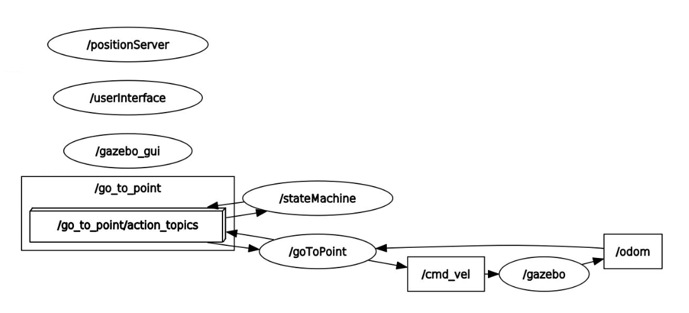

# Research Track 2 - assignment 1

```
rt2_assignment1/
  |
  action/         - action files
    |
    Control2_1.action           - action goal
  launch/         - launch files
    |
    sim.launch            - simulation launch
  scripts/        - python scripts
    |
    go_to_point.py        - pyhton script controlling the robot
    user_interface.py     - command line user interface
  src/            - C++ source code
    |
    position_service.cpp  - random position service
    state_machine.cpp     - finite state machine
  srv/            - custom services
    !
    Command.srv           - user interface service
    RandomPosition.srv    - random position service
  urdf/           - robot description for Gazebo simulation
    |
    my_robot.urdf         - robot description
  CMakeLists.txt  - CMake file
  package.xml     - manifest
```
## Package 

## Package Description

This package controls a mobile non-holonomic robot via the 'go_to_point' behaviour. More in detail, a random goal poses is generated and the robot aligns itself towards that point. The robot, then, sets its linear speed to drive to that position and, once that goal position is reached it turns itslef to match requested orientation. 
Unless the robot is stopped by the used the process continues to loop by generating a new target destination and pose.
In this specific case, due to the fasct that the robot 'go_to_point' behaviour is here implemented as an action it can be preempted, stoppinng the robot at any time and then restarting it when issuing a new goal.

## Nodes structure and explanation

Here below is reported the structure of this robot motion control algorithm:



More in detail, two nodes are implemented as python scripts
- **go_to_point**: (*go_to_point.py*) the action server managing the robot speed control depending on the goal received. This node publishes on the topics /cmd_vel the velocity of the robot and read its position by subscribing the topic '/odom' 
- **userinterface**: (*.user_interfacepy*)  the command line user interface, which sends the requests to start and stop the go_to_point behaviour.

While other two nodes have been implemented in C++:
- **positionServer**: (*position_serivice.cpp*) the server node generating a random pose once requested.
- **stateMachine**:  (*state_machine.cpp*) the finite state machine managing the request of a new goal pose when needed, sending it as a goal to 'go_to_point' action server.

More detail a bout the package can be found into its [documentation page](https://etruria89.github.io/rt2_assignment1/). 


## Compiling and Running

Compilation can be carried out sourcing the ROS Noetic path and typing:

```bash
path/to/ros_ws/$ catkin_make
```

A launch file has been provided to generate the Gazebo simulation and run all the nodes required for the control of the non-holonomic robot:
- **sim.launch**: to be used in order to launch all the nodes and the Gazebo simulation.
```bash
path/to/ros_ws/$ roslaunch rt2_assignment1 sim.launch
```
In this case the Gazebo simulation will automatically start.

## Requirements

**Gazebo** is required to run the first launch file (the scene definition is presented in this package).
